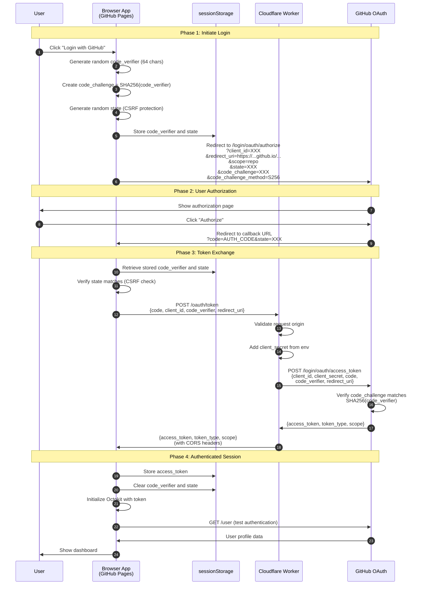
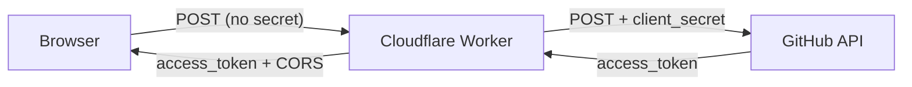

# GitHub Backend

A client-side web application that uses GitHub as a file storage backend. This is a feasibility demonstration showing how to build a serverless document manager using only GitHub Pages and GitHub's API.

## Table of Contents

1. [Overview](#overview)
2. [How It Works](#how-it-works)
3. [Setup Guide](#setup-guide)
   - [Step 1: Register a GitHub OAuth App](#step-1-register-a-github-oauth-app)
   - [Step 2: Deploy the Cloudflare Worker](#step-2-deploy-the-cloudflare-worker)
   - [Step 3: Configure and Deploy](#step-3-configure-and-deploy)
4. [Using the Application](#using-the-application)
5. [Technical Details](#technical-details)
6. [Security Considerations](#security-considerations)
7. [Troubleshooting](#troubleshooting)

---

## Overview

This application allows you to:

- **Log in** with your GitHub account
- **Create repositories** to store your documents
- **Create, edit, and delete** Markdown documents
- **Browse folders** and organize your files
- **View version history** of any document (with commit messages)
- **Restore previous versions** of documents

All data is stored in your own GitHub repositories. There is no separate database or server - GitHub *is* the backend.

---

## How It Works

### Authentication: OAuth with PKCE

This app uses GitHub's OAuth flow with **PKCE (Proof Key for Code Exchange)**. PKCE is a security extension that allows public clients (like browser apps) to authenticate without storing a client secret.

#### Detailed Authentication Flow



#### Why PKCE?

Traditional OAuth requires a "client secret" that must be kept private. Since browser code is visible to users, we can't hide a secret there. PKCE solves this by:

1. **code_verifier**: A random string generated by the app, stored only in `sessionStorage`
2. **code_challenge**: A SHA-256 hash of the verifier, sent to GitHub during authorization
3. **Verification**: GitHub verifies that whoever exchanges the auth code knows the original verifier

This proves the same app that started the login is the one finishing it, preventing authorization code interception attacks.

### Why We Need a Cloudflare Worker

GitHub's token exchange endpoint (`/login/oauth/access_token`) doesn't include CORS headers, which means browsers block direct requests to it. Our Cloudflare Worker:

1. **Proxies the request** - Receives the token exchange request from the browser
2. **Adds the client_secret** - Stored securely as an environment variable (not in browser code)
3. **Adds CORS headers** - Allows the browser to receive the response
4. **Validates origin** - Only accepts requests from your GitHub Pages domain



---

## Setup Guide

### Step 1: Register a GitHub OAuth App

You need to create an OAuth App in your GitHub account:

1. Go to **GitHub.com** → Click your profile picture → **Settings**
2. Scroll down and click **Developer settings** (in the left sidebar)
3. Click **OAuth Apps** → **New OAuth App**
4. Fill in the form:

   | Field | Value                                          |
   |-------|------------------------------------------------|
   | **Application name** | GitHub Document Manager (or any name you like) |
   | **Homepage URL** | `https://jeyabbalas.github.io/github-backend/` |
   | **Authorization callback URL** | `https://jeyabbalas.github.io/github-backend/` |

5. Click **Register application**
6. **Copy the Client ID** - you'll need this later
7. Click **Generate a new client secret** - Copy this, you'll need this later

### Step 2: Deploy the Cloudflare Worker

The Cloudflare Worker proxies the OAuth token exchange. Here's how to deploy it:

#### 2.1 Create a Cloudflare Account

1. Go to [cloudflare.com](https://cloudflare.com) and sign up (free)
2. Verify your email

#### 2.2 Create the Worker

1. Go to the [Cloudflare Dashboard](https://dash.cloudflare.com)
2. Click **Compute & AI** → **Workers & Pages** in the left sidebar
3. Click **Create application** → **Start with Hello World!**
4. Worker name: `github-oauth-proxy.jeyabbalas.workers.dev`
5. Click **Deploy** (we'll add code next)
6. Click **Edit code**
7. Replace all the code with the contents of `worker/oauth-proxy.js` from this repository
   - Update ALLOWED_ORIGINS with your GitHub Pages domain
   - Add CLIENT_SECRET as an environment variable:
     - Go to Worker Settings → Variables and Secrets → +Add
     - Type: Secret
     - Name: CLIENT_SECRET
     - Value: (your GitHub OAuth App client secret)
8. Click **Save and Deploy**

#### 2.3 Note Your Worker URL

Your worker URL will be something like:
```
https://github-oauth-proxy.jeyabbalas.workers.dev
```

Copy this URL - you'll need it in the next step.

#### 2.4 Configure Allowed Origins

For security, the worker only accepts requests from your GitHub Pages domain. Edit the `ALLOWED_ORIGINS` constant in the worker code:

```javascript
const ALLOWED_ORIGINS = [
  'https://jeyabbalas.github.io'
];
```

### Step 3: Configure and Deploy

1. Edit `js/config.js`
2. Update these values:

   ```javascript
   const CONFIG = {
     CLIENT_ID: 'your-github-oauth-client-id',
     WORKER_URL: 'https://github-oauth-proxy.jeyabbalas.workers.dev/',
     REDIRECT_URI: 'https://jeyabbalas.github.io/github-backend/'
   };
   ```

3. Commit the changes
4. Go to your repository's **Settings** → **Pages**
5. Under "Source", select **Deploy from a branch**
6. Select **main** branch and **/ (root)** folder
7. Click **Save**

Your app will be live at `https://jeyabbalas.github.io/github-backend/` in a few minutes!

---

## Using the Application

### Logging In

1. Click **Login with GitHub**
2. Authorize the app when prompted
3. You'll be redirected back and see your dashboard

### Managing Repositories

- Use the **repository dropdown** to select an existing repository
- Click **Create Repository** to create a new one for your documents

### Working with Documents

- **Browse folders**: Click folder names to navigate into them
- **Create folder**: Click **New Folder** and enter a name
- **Create document**: Click **New Document**, enter a filename (will be saved as `.md`)
- **Edit document**: Click any `.md` file to open it in the editor
- **Save changes**: Edit the content and click **Save** (you'll be prompted for a commit message)
- **Delete document**: Click the trash icon next to a file (with confirmation)

### Version History

When viewing a document:

1. Click the **History** dropdown
2. See all previous versions with:
   - Commit message
   - Date and time
   - Short commit ID
3. Click any version to view it
4. Click **Restore** to revert to that version

### Logging Out

Click **Logout** to clear your session. Your token is stored only in `sessionStorage`, so it's automatically cleared when you close the browser tab.

---

## Technical Details

### Libraries Used

- **[Octokit.js](https://github.com/octokit/octokit.js)**: Official GitHub SDK for API interactions
- No other frameworks - pure HTML/CSS/JavaScript for simplicity

### OAuth Scopes

This app requests the `repo` scope, which allows:
- Reading and writing to public and private repositories
- This is necessary for creating repos and managing files

### Token Storage

The access token is stored in `sessionStorage`:
- Cleared when you close the browser tab
- Not shared between tabs
- More secure than `localStorage` for temporary sessions

### GitHub API Endpoints Used

| Operation | Endpoint |
|-----------|----------|
| Get user info | `GET /user` |
| List repositories | `GET /user/repos` |
| Create repository | `POST /user/repos` |
| List folder contents | `GET /repos/{owner}/{repo}/contents/{path}` |
| Get file content | `GET /repos/{owner}/{repo}/contents/{path}` |
| Create/update file | `PUT /repos/{owner}/{repo}/contents/{path}` |
| Delete file | `DELETE /repos/{owner}/{repo}/contents/{path}` |
| List commits | `GET /repos/{owner}/{repo}/commits` |

---

## Security Considerations

### What's Secure

1. **PKCE**: Prevents authorization code interception attacks
2. **No client secret in browser**: PKCE eliminates this requirement
3. **Origin validation**: Cloudflare Worker only accepts requests from your domain
4. **HTTPS everywhere**: GitHub Pages enforces HTTPS
5. **sessionStorage**: Token is cleared when tab closes
6. **State parameter**: Protects against CSRF attacks during OAuth

### What to Be Aware Of

1. **Token in browser memory**: While logged in, your token is accessible via browser dev tools
2. **Full repo access**: The `repo` scope gives broad access - only use this app on trusted devices
3. **Cloudflare Worker**: You're trusting the worker with your OAuth code (but not your token directly)

### Recommendations

- Only use this on personal/trusted devices
- Log out when done
- Regularly review your [GitHub authorized applications](https://github.com/settings/applications)
- Revoke access if you suspect compromise

---

## Troubleshooting

### "Login failed" or redirect issues

- Verify your **Authorization callback URL** in GitHub OAuth settings matches exactly
- Make sure your GitHub Pages site is deployed and accessible
- Check browser console for specific error messages

### "CORS error" during login

- Ensure your Cloudflare Worker is deployed and running
- Verify the Worker URL in `js/config.js` is correct
- Check that `ALLOWED_ORIGINS` in the worker includes your GitHub Pages domain

### "Not found" errors for repositories or files

- Ensure you have the correct permissions for the repository
- Check if the repository or file exists
- Private repos require the `repo` scope (which this app requests)

### Files not appearing

- GitHub's content API may have a slight delay
- Try refreshing the page
- Check if files exist directly on GitHub.com

### Session expired

- `sessionStorage` is cleared when you close the tab
- Simply log in again

---

## License

MIT License - see [LICENSE](LICENSE) file.
